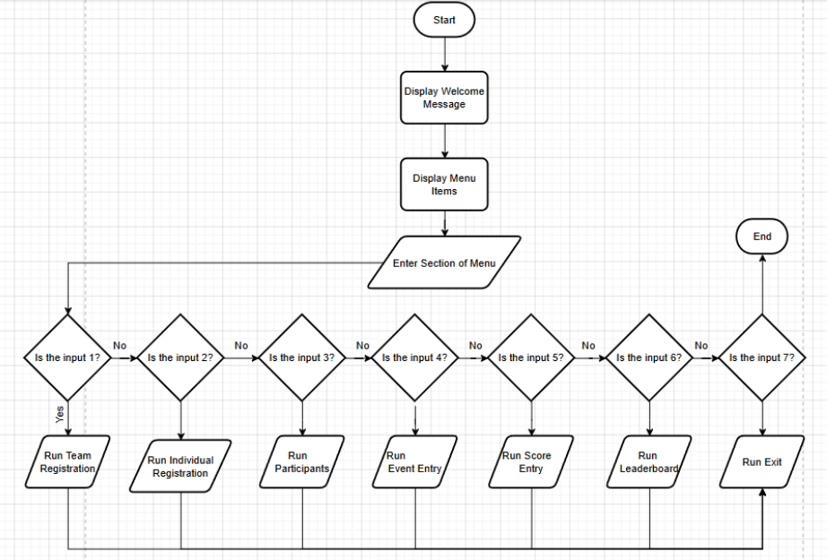
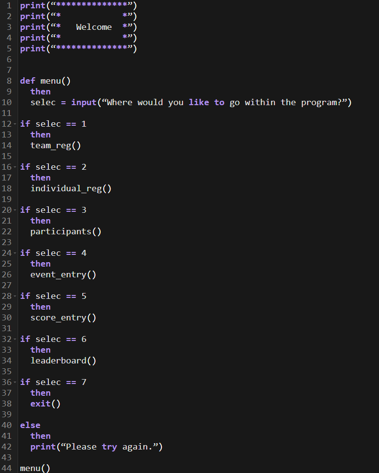

# Programming Coursework - College Tournament Scoring System

## < ----- Software Development Life Cycle (SDLC) ----- >

The software development life cycle has 6 stages: 

* Planning:

The planning stage defines the target audience, client requirements, constraints, the complexity of the software to be made. These allow the programmer to find the best and most efficient way to create the software that is needed. This involves collaboration with the client to ensure that it is feasible.   

* Analysis:

This stage is used to understand the task that has been given, understanding how the program would work and how easy or difficult it is to create it. This then allows for the understanding of the constraints of the task and to abstract the task to have the aspects needed, which can then have not as necessary features added. The purpose, features and functions necessary are then defined for the program.

* Design: 

The design is creating the code based off the requirements that are found for the program. Things such as pseudocode and flowcharts are made to understand of how the program will function before it is made, then also ensuring it meets the clients' requirements. These then work as a framework for then creating the code. The design ensures the functionality and aesthetic of the program to be meeting the requirements. 

* Implementation:

The implementation stage is when the code itself is written, turning the program into functional code. It is created based off the previously determined design and ensures it meets the clients' requirements throughout, performing certain features that the client wants. It is ensured that the code is then user-friendly, so it is clear to use and understand. A program language that was picked in the design is then used throughout the code. 

* Testing and Integration:

The testing stage creates feedback for improvements that can be made on the code, being important as it ensures the code functions correctly, performs well, is user-friendly and is secure. Numerous types of tests are used to ensure the code meets all the requirements, some of the types are unit testing, security testing, integration testing and system testing. 

* Maintenance:

The maintenance stage is after when the code is finished and is in use, the code then must have regular updates, bug fixes, changes that meet changing requirements; user needs can change with time. Updates are generally based off user/client feedback. Regular updates also ensure that the software can keep up with current systems, so users can continue to use it.

***

## < ----- SLDC Models ----- >

There are 8 software development life cycle models. However, I will be talking about 2, they are: 

* Waterfall:

The waterfall software development life cycle model is the easiest to understand approach. It follows a sequence to software development, each phase needing to be completed within the model before being able to go onto the next step of the SLDC. The structure then makes it easy to understand and use for software development. However, the waterfall model has no flexibility then making it difficult to make changes such as improvements after the stage has been moved on from. Testing is also done after the implementation which can have defects arise which cannot then be fixed. The waterfall model is best used when there are clear and fixed requirements and for smaller projects.

* Agile:

The agile software development life cycle model is like a set of principles and values that are outline. The agile model prioritises individuals, working solutions, customer collaboration and responding to changes over documentation. There are several Agile methodologies that have neem developed for these principles. It promotes an iterative approach then allowing adaptations to made from changed requirements. It is flexible, allowing fast adaptations, being vital in fast-paced environments. The communication with the client also ensures the satisfaction of the client and then reducing the risk of not meeting user requirements. 

Overall, I decided to proceed with the waterfall model due to the lack of a clear system within the agile methodology. If the client constantly makes small changes, it can become impossible for the individual implementing the code to keep up and still meet the originally desired requirements for the program. This then makes the waterfall model the ideal software development life cycle model due to the more fixed phases and clarity of the process.

***

## < ----- Problem Definition Statement ----- >

The issue is that a college wants a software solution to judge a competition. The competition run will be a tournament for students competing in a series of events for prizes. Participants will be either in teams or individuals, 4 teams with maximum of 5 members in each and 20 spaces for individual competitors. Each will be participating in 5 events or only 1, clearly being defined as individual or team events.  

Different types of events varying from sporting to academic. Each will be awarded points, which are undecided.  

The target audience for this system is for the students that want to enter the competition and for the college that wants to track the tournament results, teams and events. Some constraints are the points given for each event and rank, as they are not specified by the college and should give suggestions to the college for points that can be given for each event.

***
## < ----- Requirements ----- >

The program needs to be able to record and store the teams with all their members and all the individuals. It then needs to allow the valid team or individual to record what events they entered, then what place they came in. Then the program will display the overall results for all the teams and individuals, determining a first, second and third place.  

| Requirement  | Description | How | Output | Stored? | 
| :-------------: |:-------------:| :---------:| :----------: | :----------: |
| Registration | Teams and Individuals can register themselves onto the college tournament scoring system | Using python | A message confirming that they have been registered. | Yes | 
| Record Event | Teams and individuals can enter their events | Using python | No output | Yes | 
| Places | Teams and individuals will enter what place they came in for each event. | Using python | No output | Yes |
| Leaderboard | Will display 1st, 2nd and 3rd place | Using python | 1st, 2nd and 3rd place | No |

***

## < ----- Project Plan ----- > 

| Section | Completion | Dates |
| :-------------: |:-------------:| :---------:| 
| Planning | 100% | 20/03/2026- 25/03/2026 |
| Analysis | 100% | 25/03/2026- 30/03/2026 |
| Design | 100% | 30/03/2026-14/04/2026 |
| Implementation | 100% | 14/04/2026-11/05/2026 |
| Testing | 100% | 11/05/2026-17/05/2026 |
| Maintenance | 100% | 17/05/2026- 31/05/2026 |
| Finalisation | 100% | 31/05/2026-07/06/2026 |
| Submission | 100% | 09/06/2026 |

***
## < ----- User Interface Design ----- >

 
 

***
## < ----- Alterative User Interface Design ----- >

Beginning of the program: 

 

Team Registration: 

 
 
Individual Registration: 

 
 
Participants: 

 

Event Entries: 

 
 
Score Entries: 

 
 
Leaderboard: 

 
 
Exit: 

 

Overview: 

The design will make the interface easy to understand by separating all the information to make it easier. The places where the user is expected to enter information will also be made to be clear and easy to understand. This information will have gaps to make it easy to read even when the outputs are all on the screen. The different sections of the program will also be separated, then allowing the user to choose when they enter information into the different sections of the program. 

***
## < ----- Flowchart ----- >

***
## < ----- Pseudocode ----- >

All the subroutines will be created in the code itself, for the pseudocode I will only be creating the menu subroutine. 

***
## < ----- Feedback & Adjustments ----- >

### Feedback: 

The program is easy to understand with the clear options for the menu, using a numbered system. The confirmation message within the entry also makes it clear to the user that their information is saved. However, the menu options are very limited which then makes a lot of information be at once for the user then creating an overload which may make it difficult for users to understand the required inputs for that part in the program. There could be a clearer separation between the end of the part of the program and the menu, so it is easier to then understand. When using the program, it gives errors if the events entered are not typed in the way that they are shown, causing users to need to restart which can be very frustrating to do. The user is also unable to clearly view the participants which can cause the user confusion due to the possibility of not having entered all the teams. The team and individual entry can also prove to be very confusing due to the fact they are put together instead of clearly separated and needing to enter all the teams and individuals at once can be annoying. 

### Adjustments 

* More menu options: 

In the original design I made the user select whether they want to continue the program or end the program, I have changed this to allow the user to choose what parts of the program they enter, allowing them to enter all the information one by one when they decide. The more menu options will then be making the program easier to use due to the better clarity in the different parts of the program. 

* Allowing to view participants:

In the original design the user was unable to view the participants after they had been entered, so I added to the menu the option for the user to view the entered participants. Making the user experience much better. 

* Separating team entry and individual entry:

In the original design, the team and individual entry was clumped together making it very confusing as the user may mistake it as still team entry even though it changed to individual entry, overall, just making it very confusing. I changed it to separate the two and making it so users can choose to do either from the menu. 

* Changing team and individual entry to add one by one:

In the original design, all teams and individuals were to be entered to the maximum number stated in the client brief, however the design does not accommodate to the possibility of entering less teams/individuals. I have changed this, so the teams and individuals are entered one by one by the user by just having to re-enter the menu after each singular entry. 

***

## < ----- Structure and Validation ----- >

### Data structure and Data storage: 

Data structure is how data is structured within the program and how it is used. Some examples of data structures are dicts and arrays. These both store data and organise it.  

Some of the data structures I will be using are 2D and 3D arrays. I will be using them to store the user's data of the different team and individual entries. They will also store the events and scores for each team/individual and will be used to then create a leaderboard in the program. 

Data storage is the process of recording and preserving digital information for current and future usage. The input data is always provided by the user and the output by the computer; however, the output data cannot work without the user input first. 

Examples in my code:

### Validation

* Range Check:

A range check is a type of validation that ensures that the data is in a specified boundary, for example being between 1 and 3. 

In my code: 

* Length Check 

A length check is a type of validation that checks the length of the data such as checking the length of an array. 

In my code: 

* Presence Check 

A presence check is a type of validation that checks if anything has been entered, such as the name. 

In my code: 

* Type Check 

A type check is a type of validation that checks if the data is the correct type, such as casting.  

In my code: 

***

## < ----- Choice of Language ----- >

### Python
Python is a well-known programming language that is known as one of the easier programming languages to learn due to the similarity to English. It is used for making websites, software, automation, data analysis and visualising data. It is a programming language that is not made for a specific purpose and has many purposes. Python is an open-source programming language, meaning there is no pay-wall behind wanting to use it, making it more accessible to users. I have chosen to use python as it is free, making it best to reduce the cost. It is fast to learn, can be high performing, supports many different features, implements data types which allows for casting. It also needs less code, compared to many programming languages, making it take less time and effort. The code is easily organised, using features such as comments to make it easy to label what each part of the code is expected to do, making it good for testing, debugging and maintaining the code. Python also allows you to not need to have specific code for different operating systems, being more versatile for users. 

### C#
C# is an object-oriented programming language, sounding like languages such as C however it is more like Java. The many purposes that C# has consist of creation of mobile applications, desktop application, web applications, web services, websites, games, virtual reality, database applications and more. It is one of the most popular languages due to its ease to learn and simplicity to use. The huge community support also makes it amazing as fellow programmers can collaborate to find solutions that they need help on. It has a clear structure for programming and lets code be reused which can then reduce costs. 

### Java
Java is another object-oriented programming language which is highly portable as code can be easily moved to different devices with no problems. It needs to be compiled, unlike JavaScript and can be run anywhere. It is also one of the most popular programming languages in the world. It is used for creating mobile apps, web apps, enterprise software, IoT devices, gaming, cloud-based applications and more. It is also free to use and has many available resources for learning how to code in Java, has functions that can be used, community support for challenges that may be face, compatible with different operating systems and can be made secure. 

### JavaScript
JavaScript is a programming language used for websites and is used to update/change existing HTML and CSS code. It can make websites interactive for users. It is a browser-based language and an interpreted language which means the code is processed while it runs rather than having to compile the code while writing it. 

### Overall Decision
Overall, I have decided to use python as it is easier to use and understand due to its similarity to English. JavaScript is unsuitable to use as it is used for website and is used alongside HTML and CSS, the program is not going to be created as a website for the client but as a program. Python is a more abstracted coding language, making the overall code be shorter and faster to create. This then makes it the more ideal programming language over C# and Java due to their lengthier coding.  

***

## < ----- Test Plan ----- >

Test No. | Description | Type of Test | Expected Outcome | Result | Pass/Fail 
| :-------------: |:-------------:| :---------:| :---------:| :---------:| :---------:| 
1 | Menu works | Normal | The menu will go to the correct part of the program | Works | Pass 
2 | Allows to enter team | Normal | System should accept | System accepts | Pass 
3 | Allows to enter individual | Normal | System should accept | System accepts | Pass
4 | Allows to enter only 1 event | Normal | System should accept | System accepts | Pass 
5 | Allows to enter 5 events | Normal | System should accept | System accepts | Pass 
6 | Allows to enter 6 events | Abnormal | Error/system should not accept | System does not accept | Pass 
7 | Place entered for event 1 is written as text | Abnormal | Error/system should not accept | System accepts | Pass 
8 | Display correct number of points | Normal | Displays correct number of points | Displays correct number of points | Pass 

***

## < ----- Testing ----- >

Test No. | Description | Expected Outcome | Result | Pass/Fail | Evidence
| :-------------: |:-------------:| :---------:| :---------:| :---------:| :---------:| 
1 | Menu works | The menu will go to the correct part of the program | Works | Pass | 
2 | Allows to enter team | System should accept | System accepts | Pass | 
3 | Allows to enter individual | System should accept | 
4 | Allows to enter only 1 event | System should accept | System accepts | Pass | 
5 | Allows to enter 5 events | System should accept | System accepts | Pass | 
6 | Allows to enter 6 events | Error/system should not accept | System does not accept | Pass | 
7 | Place entered for event 1 is written as text | Error/system should not accept | System accepts | Pass | 
8 | Display correct number of points | Displays correct number of points | Displays correct number of points | Pass | 
